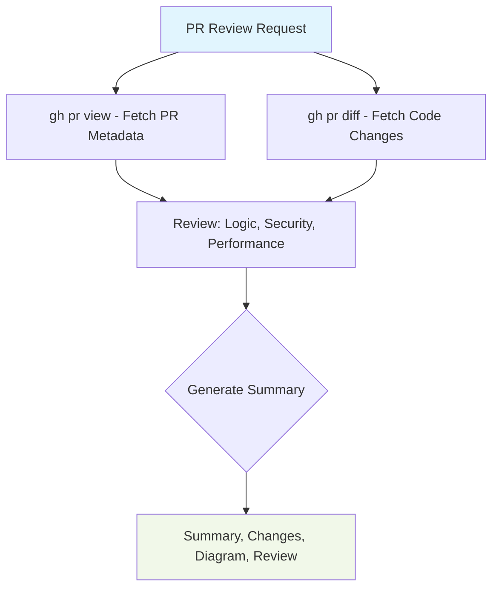

# PR Reviewer

When a user asks you to review a pull request, follow this workflow:

## Restriction

- use only Readonly tools to fetch PR details and diffs
- do not use Write tools to comment or approve PRs

## Step 1: Extract PR Identifier

From the user's message, extract the PR identifier. This can be:
- A full GitHub URL (e.g., `https://github.com/owner/repo/pull/123`)
- An owner/repo#number format (e.g., `owner/repo#123`)
- Just a PR number (if the repo is inferrable from context)

If the user provides a full URL, parse it to get owner, repo, and PR number.

## Step 2: Fetch PR Details

Run `gh pr view` to get the PR metadata:

```bash
gh pr view {number} --repo {owner}/{repo} --json title,body,author,state,createdAt,updatedAt,baseRefName,headRefName,url,labels,changedFiles,additions,deletions
```

Replace `{owner}`, `{repo}`, and `{number}` with the extracted values.

Save the output for reference.

## Step 3: Fetch PR Diff

Run `gh pr diff` to get the full code changes:

```bash
gh pr diff {number} --repo {owner}/{repo}
```

Review the diff for:
- Logic errors or bugs
- Security issues (SQL injection, XSS, exposed secrets)
- Performance concerns
- Missing error handling
- Incomplete implementations

## Step 4: Check Code Style

Look for code style guidelines in the following locations (check in order):
1. `./AGENTS.md` in the user's project
If style violations are found, note them specifically with line references from the diff.

## Step 5: Check Jira Issues (if applicable)

If the PR body or linked issues contains a Jira key (format: `PROJECT-123`), fetch the Jira issue:

```bash
jira issue view {jira-key}
```

Review the Jira issue to understand:
- The original task/issue being addressed
- Acceptance criteria
- Current issue status

## Step 6: Generate PR Summary with Mermaid Diagram

Create a comprehensive PR review summary with a Mermaid flowchart showing the PR structure, files changed, and Jira linkage.

Example Mermaid output:



## Step 7: Provide Review Summary

`gh pr comment` is a Write tool and should not be used by this skill. Instead, provide the review summary directly in the chat for the user to copy and paste into their PR comments.

## Key Principles

- Be thorough but constructive
- Reference specific lines when noting issues
- Distinguish blocking vs non-blocking issues
- Check Jira context for understanding the "why"
