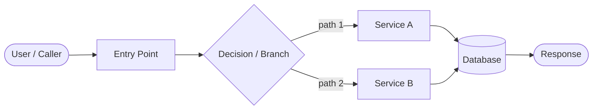
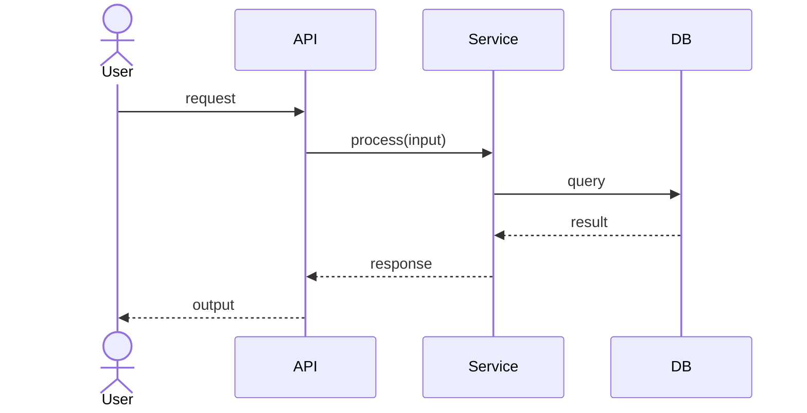

# Diagram Templates

## When to use each type

| Situation | Diagram type |
|---|---|
| Data moves through a pipeline or system | `flowchart LR` |
| Steps happen over time between actors | `sequenceDiagram` |
| States a record or job can be in | `stateDiagram-v2` |
| How components depend on each other | `graph TD` |

## Flowchart (data pipeline)

## Sequence (request-response)

> Label every arrow with the **real** field, function, or event name from the codebase. Never use generic labels like "data" or "request".
